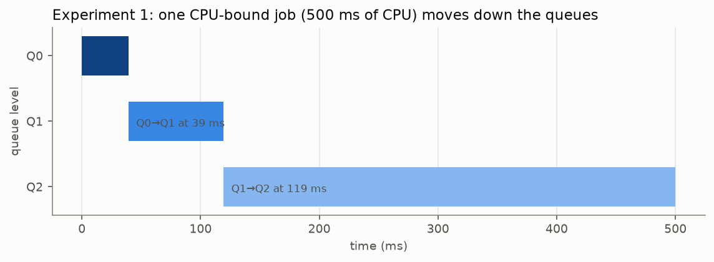
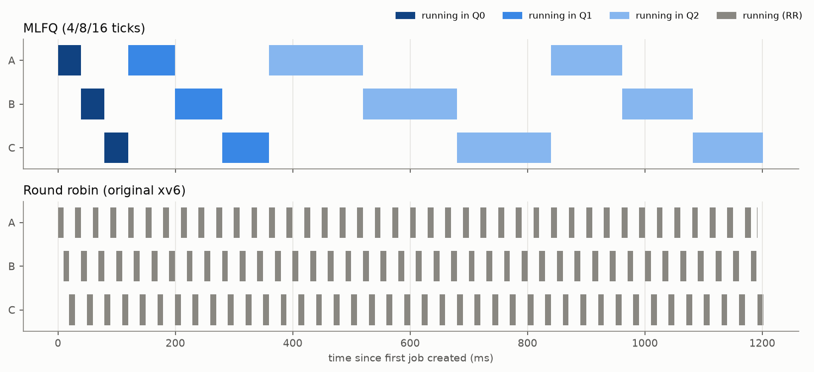
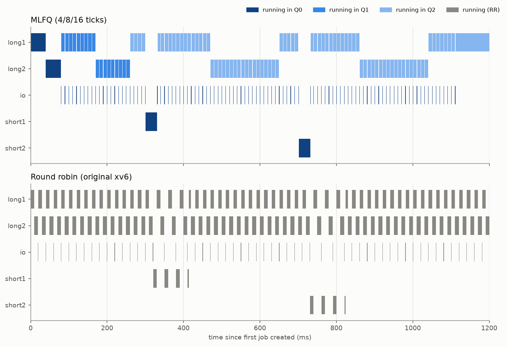
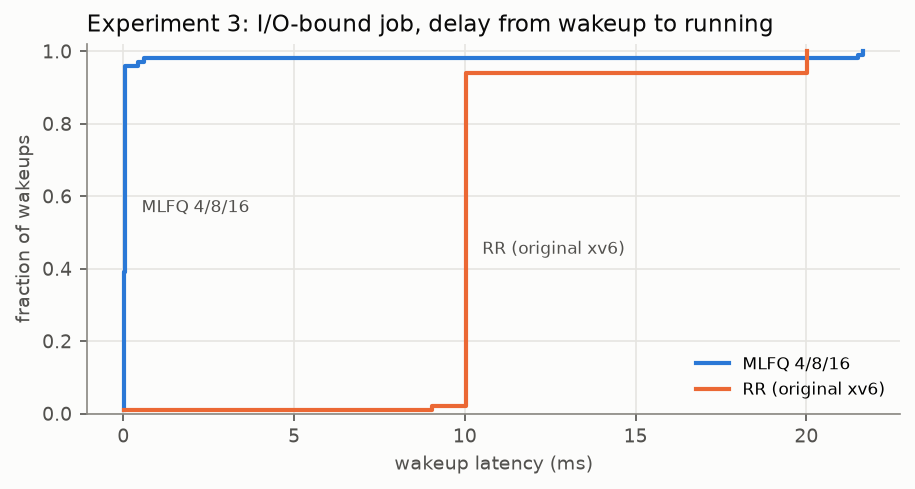
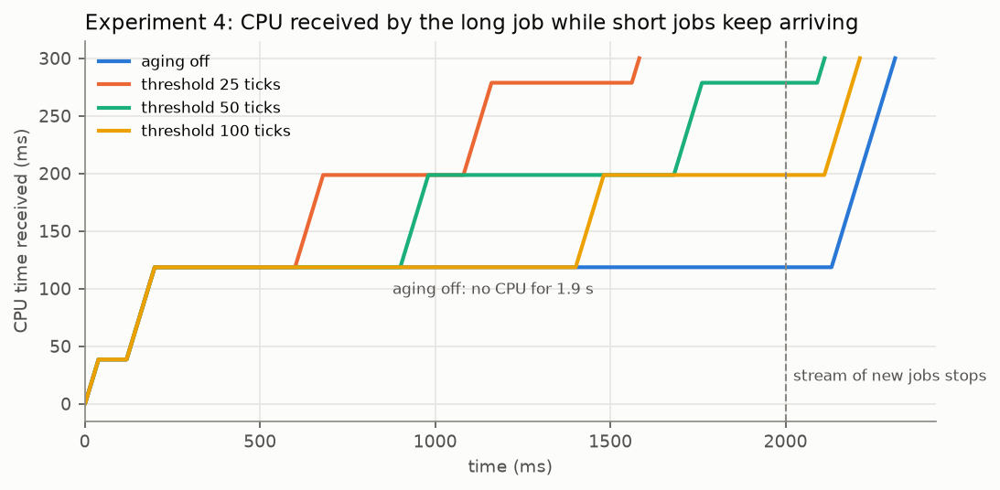
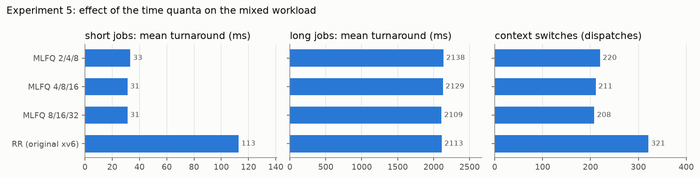

# Dynamic Priority CPU Scheduling: Implementing MLFQ in xv6

A Multilevel Feedback Queue (MLFQ) CPU scheduler for the MIT xv6-riscv
teaching operating system. The project includes exact per-process
scheduling statistics, a round-robin baseline built from the same
source tree, automated tests, controlled experiments and a quantitative
performance analysis.

---

## Contents

1. [Abstract](#1-abstract)
2. [Introduction](#2-introduction)
3. [Problem statement](#3-problem-statement)
4. [Objectives](#4-objectives)
5. [Background: scheduling in xv6](#5-background-scheduling-in-xv6)
6. [Background: MLFQ](#6-background-mlfq)
7. [MLFQ design](#7-mlfq-design)
8. [Scheduling policy](#8-scheduling-policy)
9. [Implementation details](#9-implementation-details)
10. [Modified xv6 files](#10-modified-xv6-files)
11. [Process statistics](#11-process-statistics)
12. [Benchmark programs](#12-benchmark-programs)
13. [Experimental methodology](#13-experimental-methodology)
14. [Experimental results](#14-experimental-results)
15. [Performance analysis](#15-performance-analysis)
16. [Discussion](#16-discussion)
17. [Limitations](#17-limitations)
18. [Future enhancements](#18-future-enhancements)
19. [Conclusion](#19-conclusion)
20. [Build, run and test instructions](#20-build-run-and-test-instructions)
21. [Repository structure](#21-repository-structure)
22. [References](#22-references)

---

## 1. Abstract

xv6 schedules processes round robin: every timer tick, the running
process gives up the CPU to the next RUNNABLE process in the process
table. That is fair, but it cannot tell interactive work from
long-running computation, so short and I/O-bound jobs wait behind
CPU-bound ones. This project replaces the policy with a three-level
Multilevel Feedback Queue. New processes start at the highest
priority. A process that uses its whole time quantum moves down a
level. A process that has not run for a long time moves back up
(aging). A process of a higher level preempts one of a lower level.

The scheduler is added to xv6 without changing its locking discipline:
the process table stays the only data structure and no code holds two
process locks at once. Every state change is timestamped with the
RISC-V `time` counter, so CPU time, waiting time and sleeping time add
up exactly to the turnaround time. The original round-robin scheduler
can be rebuilt from the same tree (`make SCHED=RR`) with identical
instrumentation, which makes the two directly comparable.

Five controlled experiments were run under QEMU's deterministic
instruction-count clock and repeated under the normal real-time clock.
On a mixed workload, MLFQ served 30 ms jobs in 31 ms instead of 113 ms,
cut an I/O-bound job's wakeup latency from 10–20 ms to 0.05 ms and
halved its turnaround, while CPU-bound jobs' turnaround grew by under
1 %. On CPU-bound workloads MLFQ needs a tenth of round robin's context
switches. Without aging, a demoted job starved for 1.9 s behind a stream
of short jobs; with aging, its longest wait stayed close to the
configured threshold. Shorter quanta reduce waiting among jobs of the
same level at the cost of more switching and of demoting medium-length
jobs early.

## 2. Introduction

A CPU scheduler decides which ready process runs next and for how long.
Different workloads want different things. Interactive and I/O-bound
programs need a quick response every time they wake up. Batch
computations need throughput and a guarantee that they eventually
finish. Short jobs benefit most from running first. A scheduler cannot
know in advance which kind of process it is dealing with.

MLFQ, first described by Corbató et al. for CTSS and used in some form
by most general-purpose operating systems, solves this by *learning
from behaviour*. A process's priority changes dynamically according to
how it has used the CPU. This project implements MLFQ in xv6-riscv, the
teaching operating system used in MIT 6.1810, and measures its effect.

## 3. Problem statement

The stock xv6 scheduler (`scheduler()` in `kernel/proc.c`) loops over
the process table and runs every RUNNABLE process in turn; the timer
interrupt forces a switch every tick (100 ms in stock xv6). It has no
notion of priority, so:

* a short job arriving while long jobs run shares the CPU equally with
  them and takes several times longer than it needs to;
* an I/O-bound process that wakes up waits for its turn behind every
  CPU-bound process;
* every process is switched out every tick, even when nothing more
  urgent is waiting, which costs context switches.

The task is to design and implement a dynamic priority scheduler (MLFQ)
that fixes these problems without introducing starvation or breaking
xv6's correctness, and to show by measurement what it gains and what it
costs.

## 4. Objectives

1. Implement MLFQ with three priority queues (Q0 highest, Q2 lowest)
   and configurable time quanta (default 4, 8 and 16 ticks).
2. Change priorities dynamically: new processes start in Q0; a process
   that uses its whole quantum is demoted; aging promotes processes
   that have not run for a long time, which prevents starvation.
3. Preempt a running process when its quantum expires or when a
   higher-priority process becomes RUNNABLE.
4. Keep xv6 correct: `fork`, `exit`, `wait`, `sleep`, `wakeup`,
   `kill`, `yield` and SMP locking must still work (upstream
   `usertests` must pass on 1 and 3 CPUs).
5. Measure CPU time, waiting time, sleeping time, response time and
   turnaround time for every process with a sound, verifiable
   mechanism, plus queue transitions.
6. Provide CPU-bound, I/O-bound and mixed benchmark workloads, and a
   baseline (the original scheduler) measured in exactly the same way.
7. Run controlled experiments, analyse the results and document
   everything.

## 5. Background: scheduling in xv6

The parts of xv6-riscv that take part in scheduling:

| Component | File | Role |
|---|---|---|
| `struct proc`, `enum procstate` | `kernel/proc.h` | Per-process state: `UNUSED`, `USED`, `SLEEPING`, `RUNNABLE`, `RUNNING`, `ZOMBIE`; protected by `p->lock`. |
| `scheduler()` | `kernel/proc.c` | Per-CPU loop: scan `proc[]`, and for each RUNNABLE process set it RUNNING and `swtch()` to it. |
| `sched()` | `kernel/proc.c` | Called by a process holding only `p->lock` after changing its state; switches back to the CPU's scheduler. |
| `yield()` | `kernel/proc.c` | RUNNING → RUNNABLE, then `sched()`. |
| `sleep_prepare()`, `sleep()`, `wakeup()` | `kernel/proc.c` | RUNNING → SLEEPING on a channel, and SLEEPING → RUNNABLE. |
| `kfork()`, `kexit()`, `kwait()`, `kkill()` | `kernel/proc.c` | Process creation (→ RUNNABLE), exit (→ ZOMBIE), reaping (→ UNUSED), kill. |
| `clockintr()` | `kernel/trap.c` | Timer interrupt: CPU 0 increments `ticks` and wakes sleepers on `&ticks`; every CPU re-arms its timer (`stimecmp`). |
| `usertrap()`, `kerneltrap()` | `kernel/trap.c` | On a timer interrupt, call `yield()`, which preempts the process. |
| `timerinit()` | `kernel/start.c` | Arms the first timer interrupt. |

The locking rules that any scheduler must respect:

* `p->lock` protects `p->state` (and, here, all scheduling fields).
* `scheduler()` acquires `p->lock` before switching to `p` and the
  process releases it (in `yield()`, `sleep()`, `forkret()`), and
  vice versa. `sched()` panics unless exactly one lock
  (`p->lock`) is held and interrupts are off.
* `wait_lock` must be acquired before any `p->lock`.

The stock policy is therefore round robin with a one-tick quantum,
applied in process-table order.

## 6. Background: MLFQ

MLFQ keeps several ready queues of decreasing priority and follows
rules like these (after Arpaci-Dusseau, *OSTEP*, ch. 8):

1. If A has a higher priority than B, A runs.
2. If A and B have the same priority, they run round robin with the
   queue's time quantum.
3. A new job enters the highest-priority queue.
4. Once a job has used up its time allotment at a level (however many
   times it gave up the CPU), it moves down one level.
5. Something must stop long-running jobs from starving and let jobs
   whose behaviour changes move back up: OSTEP uses a periodic
   priority boost; this project uses **aging**, which promotes each
   process individually after it has gone without the CPU for a while.

A job with short CPU bursts (interactive or I/O-bound) never uses up
its quantum and so stays at high priority. A CPU-bound job sinks to the
lowest level, where long quanta give it throughput with few switches.
Without knowing job lengths in advance, MLFQ approximates
shortest-job-first for short jobs and round robin for long ones.

## 7. MLFQ design

### 7.1 Review of the previous implementation

The repository previously contained a basic MLFQ. Inspecting and
running it showed these problems, which is why the scheduler was
rewritten from the upstream sources instead of patched:

| Problem | Effect |
|---|---|
| `timer_yield()` preempted the running process on **every** tick; the quanta only decided when to demote it. | Quanta were not time slices: in effect a 1-tick round robin with priorities. |
| The scheduler picked the **lowest-index** RUNNABLE process of the best level. | No round robin inside a level. With three identical CPU-bound jobs, a Ctrl-P snapshot showed one with 80 ticks of CPU and the other two with 20 each; the others only ran when aging promoted them. |
| The quantum counter was reset on every wakeup. | A process could keep a high priority forever by sleeping just before its quantum ended. |
| Aging and waiting time were counted by sampling once per tick in the timer interrupt. | Approximate; runs of less than a tick were invisible; the statistics were never checked to add up. |
| Statistics were printed by the kernel for every exiting process. | Noisy (e.g. every background command printed a line) and not available to programs. |
| `fs.img` depended on `README`, which had been renamed. | `make` failed after `make clean`. |

### 7.2 Design goals

* **Keep xv6's structure.** `scheduler()`, `sched()`, `yield()`,
  `sleep()` and `wakeup()` keep their roles and locking. The policy
  lives in a separate file, `kernel/sched.c`, that `proc.c` calls.
* **No new locks between processes.** The process table remains the
  only process data structure. "Queues" are implicit, so there are no
  linked lists to keep consistent under concurrency.
* **Exact measurement.** Time is accounted at every state change with
  the hardware time counter, not sampled.
* **Same instrumentation for the baseline.** `make SCHED=RR` builds the
  original round-robin loop with the same accounting code.
* **Configurable** through named constants and `make` variables.

### 7.3 Architecture

```
                       timer interrupt (every tick, every CPU)
                                     |
   usertrap()/kerneltrap()  ---->  sched_tick()  -- 1 --> yield()
        (trap.c)                  (sched.c)               (proc.c)
                                     |  charge CPU time,             |
                                     |  quantum expired? -> demote   v
                                     |  higher level RUNNABLE?      sched() --swtch--> scheduler()
                                     |  aging of waiting procs                              (proc.c)
                                                                                              |
                                                                  sched_select()  <----------+
                                                                  (sched.c): highest level,
                                                                  FIFO within level, aging
   every state change:  proc_setstate(p, new)  (sched.c)
       fork/userinit -> RUNNABLE, scheduler -> RUNNING, yield -> RUNNABLE,
       sleep -> SLEEPING, wakeup/kill -> RUNNABLE, exit -> ZOMBIE
       => time since the last change is added to cpu / wait / sleep time
```

### 7.4 Queues without lists

Each process has a level `p->priority` (0, 1 or 2) and a queue
position `p->qseq`, a number drawn from a global counter whenever the
process joins the **tail** of a queue. Choosing the RUNNABLE process
with the smallest `(priority, qseq)` is exactly "take the head of the
highest non-empty FIFO queue". Moving a process to another queue is an
assignment to two integers under `p->lock`. The scan is the same
O(NPROC) loop the original scheduler already performs.

### 7.5 Configuration

All tunables are named constants in `kernel/param.h` and can be
overridden from `make`:

| Constant | Default | `make` variable | Meaning |
|---|---|---|---|
| `TICK_HZ` | 100 (10 ms tick) | `TICK_HZ=` | Timer interrupts per second (stock xv6: 10) |
| `NQUEUE` | 3 | – | Number of levels |
| `Q0_QUANTUM`, `Q1_QUANTUM`, `Q2_QUANTUM` | 4, 8, 16 ticks | `QUANTA="q0 q1 q2"` | Quantum of each level |
| `AGING_THRESHOLD` | 50 ticks | `AGING=` (0 = off) | Promote after this long without running |
| `SCHED_RR` | not set | `SCHED=RR` | Build the original round-robin scheduler |
| `CPUS` | 1 | `CPUS=` | CPUs given to QEMU (stock xv6: 3) |

Why these values:

* **10 ms tick.** Stock xv6's 100 ms tick would make a 4-tick quantum
  0.4 s and the aging threshold 5 s, far coarser than real systems
  (Linux uses 1–4 ms ticks and time slices of a few ms). With 10 ms the
  quanta are 40/80/160 ms and aging is 0.5 s, and experiments run in
  seconds instead of minutes. Everything that counts in ticks (for
  example `pause()`) just runs ten times faster in wall-clock terms;
  `usertests` passes unchanged.
* **4/8/16 ticks.** Doubling the quantum at each level is the classic
  choice. Q0 is short so that interactive jobs are served quickly;
  Q2 is long so CPU-bound jobs switch rarely. A job must use 12 ticks
  (120 ms) of CPU before it reaches Q2.
* **Aging = 50 ticks.** It must be longer than a normal wait among
  equals, or aging would keep undoing demotion. Three CPU-bound jobs in
  Q2 each wait 2 × 16 = 32 ticks between turns, so aging does not
  trigger among them, while a job starved by higher levels is promoted
  within half a second.
* **One CPU by default.** With one CPU the schedule is easy to reason
  about and experiments are reproducible. Everything also works with
  more CPUs (tested with 3).

## 8. Scheduling policy

The complete policy, as implemented in `kernel/sched.c`:

1. **Levels.** There are three levels. Q0 has the highest priority.
2. **New processes** start in Q0 at the tail of the queue.
3. **Selection.** The scheduler runs the RUNNABLE process at the
   highest non-empty level. Within a level, the process that joined
   the queue earliest runs first (FIFO, i.e. round robin).
4. **Quantum.** A process may use `quantum[level]` ticks of CPU time at
   its level. The quantum is consumed by CPU time only and is **not
   reset when the process sleeps**, so sleeping just before the quantum
   ends does not avoid demotion (OSTEP's revised rule 4).
5. **Demotion.** When the quantum is used up the process is preempted,
   moves down one level (Q0 → Q1 → Q2; in Q2 it just starts a new
   quantum) with a fresh quantum, and joins the tail of its new queue.
6. **Priority preemption.** On every tick, if a process of a higher
   level than the running one is RUNNABLE (for example, an I/O-bound
   process that has just woken up), the running process is preempted.
   It keeps its place at the head of its queue and the rest of its
   quantum.
7. **Aging.** A process that has not run for `AGING_THRESHOLD` ticks
   moves up one level (and one more for every further
   `AGING_THRESHOLD` ticks), with a fresh quantum, at the tail of the
   new queue. Aging is checked for every RUNNABLE process on every tick
   and at every scheduling decision.
   * If the process was RUNNABLE all that time, it is being starved by
     higher levels, and aging lets it in.
   * If it was SLEEPING (for example, the shell waiting for a key
     press), it has shown interactive behaviour, and aging undoes an
     earlier demotion. Without this, long-lived interactive processes
     slowly use up their quanta over their lifetime (rule 4) and end up
     in Q2 for good. The first implementation showed exactly this
     effect: a test driver sank to Q2 and started jobs late.
   * A process that sleeps only briefly, as one gaming rule 4 would,
     is never promoted.

### Why the policy is correct

* **Priority.** The chosen process always has the minimum level among
  RUNNABLE processes (`sched_select()` scans them all), and a running
  process is preempted within one tick when a higher-level process
  becomes RUNNABLE (`sched_tick()`). So a lower-level process never
  runs for more than one tick while a higher-level one waits.
* **Round robin within a level.** A process receives a new `qseq`
  (tail) exactly when it joins a queue: on creation, on wakeup, on
  quantum expiry and on promotion. A process preempted by a higher
  level keeps its `qseq`. FIFO order therefore holds, and each process
  at the level runs for at most one quantum before every other process
  that was waiting at that level runs.
* **Demotion.** `quantum_used` is increased only by time spent RUNNING
  (in `account()`) and reset only on a level change or quantum expiry,
  so demotion depends on CPU time used at the level, regardless of
  sleeping.
* **No starvation.** A RUNNABLE process at level L > 0 is promoted
  after at most `AGING_THRESHOLD` ticks (plus one tick of detection
  delay), and again after the same time at L − 1. In Q0 it waits
  behind at most the Q0 processes ahead of it in FIFO order. So its
  waiting time is bounded by about `L × AGING_THRESHOLD` ticks plus a
  finite number of quanta. Experiment 4 measures this bound.
* **Timing precision.** Quanta are measured exactly but can only be
  enforced at a timer interrupt. A quantum counts as expired when less
  than half a tick of it remains, so each quantum is enforced to within
  ±½ tick (measured in Experiment 1 and checked by `schedtest`).

## 9. Implementation details

### 9.1 Process state (`kernel/proc.h`)

New fields in `struct proc`, all protected by `p->lock`:

```c
int priority;          // current queue level, 0 = highest
uint64 quantum_used;   // timebase cycles of the current quantum used
uint64 qseq;           // position in its queue (smaller runs first)
uint64 age_since;      // last ran or last promoted, for aging
uint64 state_since;    // when the current state was entered
uint64 ctime, first_run, etime;                // creation, first run, exit
uint64 cpu_time, wait_time, sleep_time;        // time in each state
uint64 level_time[NQUEUE];                     // CPU time at each level
uint64 max_wait;                               // longest RUNNABLE period
int ndispatch, nexpire, npreempt, nsleep, ndemote, npromote;
```

### 9.2 State changes: `proc_setstate()`

Every assignment `p->state = RUNNABLE/RUNNING/SLEEPING/ZOMBIE` in
`proc.c` (in `userinit`, `kfork`, `scheduler`, `yield`, `sleep`,
`wakeup`, `kkill`, `kexit`) is replaced by
`proc_setstate(p, state)`, called with `p->lock` held as before. It:

1. adds `now − p->state_since` to the bucket of the *old* state
   (`cpu_time` for RUNNING, which also adds to `quantum_used` and
   `level_time[priority]`; `wait_time` for RUNNABLE; `sleep_time` for
   SLEEPING), where `now = r_time()`;
2. sets `ctime` when a new process first becomes RUNNABLE, and
   `first_run` on its first dispatch;
3. puts a newly created or woken process at the tail of its queue;
4. records `age_since` when a process stops running, and `etime` on
   exit;
5. appends an event to the trace buffer if tracing is on.

### 9.3 Choosing the next process: `sched_select()`

```c
for (;;) {
  best = 0;
  for (each p in proc[]) {              // one lock at a time, as before
    acquire(&p->lock);
    if (p->state == RUNNABLE) {
      age(p, now);
      if (best == 0 || (p->priority, p->qseq) < (best_prio, best_seq))
        best = p, ...;
    }
    release(&p->lock);
  }
  if (best == 0) return 0;              // idle: scheduler() executes wfi
  acquire(&best->lock);
  if (best->state == RUNNABLE) return best;   // returned locked
  release(&best->lock);                 // another CPU took it: rescan
}
```

`scheduler()` then runs the process exactly as the original loop did.
The only lock held across `swtch()` is `p->lock`, so `sched()`'s
checks (one lock held, interrupts off) are unchanged. The re-check
after re-acquiring the lock handles the race with another CPU.

### 9.4 The timer tick: `sched_tick()`

`usertrap()` and `kerneltrap()` used to call `yield()` on every timer
interrupt. They now call `yield()` only if `sched_tick()` returns 1:

```c
acquire(&p->lock);
account(p, r_time());                    // charge CPU time so far
if (p->quantum_used + TICK/2 >= quantum(p->priority)) {
  p->nexpire++;
  demote p (or, in Q2, start a new quantum);
  p->qseq = tail();                      // round robin
  release(&p->lock);
  return 1;
}
release(&p->lock);
return higher_runnable(p, prio);         // also applies aging
```

`higher_runnable()` scans the table (one lock at a time, never while
holding `p->lock`), applies aging to RUNNABLE processes, and reports
whether any is at a higher level. With `SCHED=RR`, `sched_tick()`
simply returns 1, which is the original behaviour.

### 9.5 Interaction with the rest of xv6

| Operation | What happens |
|---|---|
| `fork()` | `allocproc()` calls `sched_procinit()` (level 0, counters zero); `kfork()` makes the child RUNNABLE via `proc_setstate()`, which sets `ctime` and puts it at the tail of Q0. |
| `exit()` | `kexit()` → `proc_setstate(ZOMBIE)` records the final CPU time and `etime`. Statistics survive until the parent reaps the zombie. |
| `wait()` | `kwait()` gets an extra argument; `waitstat()` copies the zombie's statistics to the parent before `freeproc()`. |
| `sleep()` / `wakeup()` | State changes through `proc_setstate()`. Sleeping does not reset the quantum. A woken process joins the tail of its level's queue and may be promoted by aging if it has not run for long. |
| `kill()` | A sleeping victim is made RUNNABLE via `proc_setstate()`. |
| `yield()` | Unchanged except for `proc_setstate()`; called when `sched_tick()` says so. |
| SMP | All new fields are under `p->lock`; the queue counter and CPU count use atomic operations; the trace buffer has its own spinlock, which is only acquired while holding at most one `p->lock` and never the other way round. |

### 9.6 New system calls

| Call | Purpose |
|---|---|
| `int getprocstat(int pid, struct procstat *st)` | Live statistics of a process (pid 0 = caller), including time in its current state. |
| `int waitstat(int *status, struct procstat *st)` | `wait()` that also returns the child's final statistics. |
| `int schedinfo(struct schedinfo *si)` | Policy, quanta, aging threshold, tick length and CPU count of the running kernel. |
| `int schedtrace(int on, struct schedevent *buf, int max)` | Start recording scheduler events (state and level changes, with timestamps), or stop and copy them out. |

`struct procstat`, `struct schedinfo` and `struct schedevent` are
defined in `kernel/pstat.h`, which user programs include.

### 9.7 Ctrl-P

The Ctrl-P process listing (`procdump()`) now shows each process's
level, quantum used, CPU/wait/sleep time (ms), dispatches, demotions and
promotions:

```
1 sleep  init Q0 qused=41 cpu=41 wait=41 sleep=2022 disp=25 demote=0 promote=0
2 sleep  sh Q0 qused=35 cpu=35 wait=40 sleep=1980 disp=29 demote=0 promote=0
80 run    cpubench Q2 qused=71 cpu=349 wait=4 sleep=0 disp=4 demote=2 promote=0
```

## 10. Modified xv6 files

Compared with upstream xv6-riscv (commit `9e3161a` in this history):

| File | Change |
|---|---|
| `kernel/sched.c` | **New.** The MLFQ policy: `proc_setstate()`, `sched_select()`, `sched_tick()`, aging, demotion, statistics, trace buffer, system call back-ends. |
| `kernel/pstat.h` | **New.** `struct procstat`, `struct schedinfo`, `struct schedevent` (shared with user space). |
| `kernel/param.h` | Scheduler and timer configuration constants. |
| `kernel/proc.h` | Scheduling and statistics fields in `struct proc`. |
| `kernel/proc.c` | State changes go through `proc_setstate()`; `scheduler()` uses `sched_select()` (the original loop is kept under `SCHED_RR`); `kwait()` can return statistics; `procdump()` prints scheduling information; `procinit()` initialises `sched.c`. |
| `kernel/trap.c` | Yield on a timer interrupt only when `sched_tick()` says so; timer interval `TICK_CYCLES`. |
| `kernel/start.c` | First timer interrupt uses `TICK_CYCLES`. |
| `kernel/defs.h` | Prototypes for `sched.c`; `kwait()` takes a second argument. |
| `kernel/syscall.h`, `kernel/syscall.c`, `kernel/sysproc.c` | Four new system calls. |
| `user/user.h`, `user/usys.pl` | User-space stubs for the new system calls. |
| `Makefile` | `sched.o`; `SCHED`, `QUANTA`, `AGING`, `TICK_HZ` options (a stamp file rebuilds the kernel when they change); `QEMUEXTRA`; `CPUS := 1`; new user programs; `fs.img` fixed. |

`kernel/main.c`, `kernel/syscall.c`'s dispatcher, `sched()`,
`swtch.S` and the rest of the kernel are unchanged.

## 11. Process statistics

All times are measured with the RISC-V `time` counter (10 MHz on
QEMU's `virt` machine, 0.1 µs resolution) and reported in
microseconds. The counter is read at **every** state change of a live
process, and the time since the previous change is added to the
bucket of the state being left.

| Metric | Definition |
|---|---|
| creation time (`ctime`) | Moment the process first becomes RUNNABLE, i.e. when `fork()` has finished building it |
| first run (`first_run`) | Moment of its first dispatch (RUNNABLE → RUNNING) |
| completion (`etime`) | Moment it calls `exit()` (RUNNING → ZOMBIE) |
| CPU time | Total time in state RUNNING (user and kernel mode) |
| waiting time | Total time in state RUNNABLE: ready but not running |
| sleeping time | Total time in state SLEEPING: blocked (I/O, `pause`, `wait`, pipes…) |
| response time | `first_run − ctime` |
| turnaround time | `etime − ctime` |
| longest wait | Longest single uninterrupted RUNNABLE period (measures starvation) |
| CPU time per level | CPU time used while in Q0, Q1, Q2 |
| dispatches | Times the process was given the CPU (context switches to it) |
| quantum expirations / preemptions / sleeps | Why it left the CPU: used a full quantum / a higher level became RUNNABLE / blocked |
| demotions / promotions | Level changes down (quantum expiry) and up (aging) |

**Consistency.** Between creation and exit a process is always exactly
one of RUNNABLE, RUNNING or SLEEPING, and every transition charges the
elapsed time to exactly one bucket, so

```
turnaround = cpu_time + wait_time + sleep_time        (exactly)
cpu_time   = level_time[0] + level_time[1] + level_time[2]
```

`schedtest` checks both identities for every process it creates (to
within 3 µs of rounding). This is also why creation time is taken when
the process becomes RUNNABLE rather than in `allocproc()`: while
`fork()` is still copying memory the child is in state `USED`, and the
parent can even be preempted in between. That time belongs to the
parent.

**Same mechanism for the baseline.** The round-robin build uses the
same `proc_setstate()` accounting, so the metrics mean exactly the same
thing under both policies.

**Why not tick sampling?** Counting a tick for whichever process
happens to be running when the timer fires (as the previous version
did) misses anything shorter than a tick. It also systematically
under-charges processes whose runs end before the tick, such as
I/O-bound ones. Timestamps at state changes are exact.

## 12. Benchmark programs

Workloads are defined by the **CPU time they need**, not by a number of
loop iterations. A CPU-bound job spins in short chunks and asks the
kernel (`getprocstat`) how much CPU time it has used until it reaches
its target (`burn_ms()` in `user/bench.h`). The same job therefore does
the same amount of work whatever the host speed or the competition,
just as a job in a textbook scheduling problem has a fixed "service
time".

| Program | Behaviour | Purpose |
|---|---|---|
| `cpubench [ms]` | Pure computation for `ms` ms of CPU, or forever | Long-running CPU-bound process; watch it sink with Ctrl-P |
| `cpubench_med` | 300 ms of CPU (30 ticks) | Medium job: passes through Q0 and Q1 into Q2 and finishes |
| `cpubench_short` | 30 ms of CPU (3 ticks) | Short job: finishes within its Q0 quantum |
| `iobench [n] [us]` | `n` times: `us` µs of CPU, then block for one tick (default 50 × 500 µs) | I/O-bound process (the tick sleep stands in for a device) |
| `schedtime [-n k] cmd …` | Runs `k` concurrent copies of a command and prints each copy's statistics when it exits (like `time`) | Interactive demonstrations |
| `schedtest` | Automated functional tests (section 20.4) | Verification |
| `mlfqexp <exp> [reps]` | The controlled experiments (section 13) | Measurement |

Example (on the default MLFQ kernel):

```
$ schedtime -n 3 cpubench_med
pid 72 cpubench_med: Q2 cpu=302.2 wait=571.5 sleep=0.0 response=0.5 turnaround=873.8 ms  dispatch=4 demote=2 promote=0
pid 73 cpubench_med: Q2 cpu=302.8 wait=603.6 sleep=0.0 response=44.0 turnaround=906.4 ms  dispatch=4 demote=2 promote=0
pid 74 cpubench_med: Q2 cpu=302.5 wait=635.2 sleep=0.0 response=84.5 turnaround=937.8 ms  dispatch=4 demote=2 promote=0
$ schedtime iobench 20
pid 76 iobench: Q0 cpu=15.8 wait=3.2 sleep=190.8 response=0.1 turnaround=210.0 ms  dispatch=26 demote=0 promote=0
```

(CPU is a few ms above 300 because `exec()` and program start-up also
use CPU. The experiments below fork jobs without `exec()` to avoid
this.)

## 13. Experimental methodology

### 13.1 Driver

`mlfqexp` runs an experiment as follows:

1. The main process starts the kernel trace (`schedtrace`) and forks a
   fresh **repetition driver**. Because the driver is new, it starts in
   Q0 with a full quantum no matter what happened before.
2. The driver forks each job (a child that runs its workload and exits)
   at the job's arrival time, sleeping in between, and collects every
   job's final statistics with `waitstat()`. It does almost no work
   itself, so it does not disturb the measurement.
3. The driver sends the statistics to the main process through a pipe
   and exits. Only then does the main process read the trace and print
   everything, so printing cannot disturb the jobs.

Time 0 of a repetition is the creation of its first job.

### 13.2 Experiments

| # | Name | Jobs (CPU demand, arrival time) | Question |
|---|---|---|---|
| 1 | `single` | one CPU-bound job, 500 ms, t = 0 | Does a CPU-bound process move Q0 → Q1 → Q2 after exactly 4 and 8 ticks? What does MLFQ cost a process that is alone? |
| 2 | `multi` | three CPU-bound jobs A, B, C, 400 ms each, t = 0 | Demotion under competition, round robin in Q2, waiting time, fairness, completion order |
| 3 | `mixed` | `long1`, `long2`: 1000 ms CPU-bound, t = 0; `io`: 100 × (1 ms CPU + 1 tick sleep), t = 0; `short1`, `short2`: 30 ms, t = 300 ms and 700 ms | How do CPU-bound, I/O-bound and short jobs fare together? |
| 4 | `aging` | `long`: 300 ms, t = 0; a stream of 100 ms jobs, always two running, new ones started for 2 s | Starvation and aging: the stream jobs finish before leaving Q1 (4 + 6 ticks), so without aging they keep Q0/Q1 busy and `long` starves in Q2 |
| 5 | quanta | experiments 1–3 with quanta 2/4/8, 4/8/16 and 8/16/32 ticks | Effect of the quantum length |

Each experiment is also run on the **original xv6 round-robin
scheduler** (`make SCHED=RR`). Experiment 4 is also run with aging
disabled and with thresholds of 25 and 100 ticks.

### 13.3 Fair comparison with the original scheduler

Both kernels are built from the same source tree and differ only in
`scheduler()`'s selection loop and in `sched_tick()` (MLFQ decides when
to preempt; RR always preempts). They use the same timer (10 ms), the
same `proc_setstate()` accounting and the same system calls,
workloads, driver and analysis scripts. Their numbers are therefore
directly comparable. Note that the baseline is the original policy
(round robin with a 1-tick quantum), running with the 10 ms tick used
throughout this project rather than stock xv6's 100 ms.

### 13.4 Environment and repeatability

All experiments run on one emulated CPU (`CPUS=1`) under QEMU 8.2.2
(`qemu-system-riscv64 -machine virt`) on a Linux x86-64 host. Each
configuration boots a freshly built kernel. Everything is automated:

```
scripts/run_experiments.py      # build, boot, run, save results/raw/<mode>/<config>.log
scripts/analyze.py              # results/summary.md, results/*.csv, docs/figures/*.png
```

Every experiment was run in two clock modes:

* **Deterministic mode** (`icount`, 3 repetitions). QEMU is started with
  `-icount shift=0,sleep=off`: the virtual clock advances by 1 ns per
  executed guest instruction, and idle time is skipped. The emulated
  machine then behaves like a 1 GHz CPU whose timing does not depend on
  the host at all, so repetitions give the same schedule. The results
  and figures below use this mode.
* **Real-time mode** (5 repetitions). QEMU's normal clock follows host
  time, as in an ordinary `make qemu`. Host scheduling adds noise, so
  results are reported as mean ± standard deviation. This mode checks
  that the conclusions do not depend on the deterministic clock.

Absolute numbers include the cost of the emulated kernel itself, for
example about 0.1–0.2 ms from a wakeup to the woken process running.

## 14. Experimental results

All numbers below are **measured**. They come from deterministic-mode
runs (3 repetitions each, which differed by at most 31 µs in any time
metric), are in milliseconds, and were produced by
`scripts/analyze.py` from the raw logs in `results/raw/`. The complete
tables for both clock modes are in [`results/summary.md`](results/summary.md),
and every job's statistics are in `results/jobs_icount.csv` and
`results/jobs_realtime.csv`. "MLFQ" means the default configuration
(quanta 4/8/16 ticks, aging 50 ticks); "RR" is the original xv6
scheduler.

### 14.1 Experiment 1 – a single CPU-bound job (500 ms of CPU)



| config | CPU | wait | turnaround | dispatches | demotions | CPU in Q0 | CPU in Q1 | CPU in Q2 |
|---|---:|---:|---:|---:|---:|---:|---:|---:|
| MLFQ 4/8/16 | 500.0 | 0.1 | 500.1 | 5 | 2 | 39.2 | 80.1 | 380.7 |
| MLFQ 2/4/8 | 500.0 | 0.1 | 500.1 | 8 | 2 | 19.2 | 40.0 | 440.8 |
| MLFQ 8/16/32 | 500.0 | 0.0 | 500.1 | 3 | 2 | 79.3 | 160.2 | 260.6 |
| RR | 500.0 | 0.6 | 500.7 | 51 | 0 | – | – | – |

* The job is demoted Q0 → Q1 after 39.2 ms of CPU and Q1 → Q2 after a
  further 80.1 ms: the configured 40 ms and 80 ms, to within the ±½-tick
  enforcement precision. The other configurations scale in the same way.
* Alone on the CPU, a process loses nothing under MLFQ (turnaround =
  CPU time + 0.1 ms). Round robin switches it out and straight back in
  on **every** tick (51 dispatches, 0.6 ms of waiting), because it
  preempts even when nothing else is RUNNABLE. MLFQ only preempts when
  a quantum expires or a higher level is waiting, so it has 5
  dispatches.

### 14.2 Experiment 2 – three CPU-bound jobs (400 ms each, arriving together)



| | job | response | wait | turnaround | dispatches | longest wait |
|---|---|---:|---:|---:|---:|---:|
| **MLFQ** | A | 0.8 | 561.4 | 961.5 | 4 | 320.4 |
| | B | 38.9 | 681.0 | 1081.1 | 4 | 281.7 |
| | C | 78.6 | 800.6 | 1200.7 | 4 | 320.4 |
| **RR** | A | 0.8 | 792.3 | 1192.3 | 41 | 20.0 |
| | B | 8.9 | 789.7 | 1189.8 | 40 | 20.0 |
| | C | 18.5 | 801.0 | 1201.0 | 42 | 20.0 |

| | mean turnaround | completion order | spread of finish times | total dispatches |
|---|---:|---|---:|---:|
| MLFQ 2/4/8 | 1181.2 | A → B → C | 39.8 | 21 |
| MLFQ 4/8/16 | 1081.1 | A → B → C | 240.0 | 12 |
| MLFQ 8/16/32 | 1041.0 | A → B → C | 320.0 | 9 |
| RR | 1194.4 | B → A → C | 11.6 | 123 |

* All three jobs go Q0 → Q1 → Q2 (2 demotions each). The timeline shows
  the FIFO order at every level: A, B, C take turns with 40 ms slices
  in Q0, 80 ms in Q1 and 160 ms in Q2. No promotions happen: each job
  waits at most 320 ms (2 × 160 ms) between slices, below the 500 ms
  aging threshold.
* **Fairness.** All three jobs receive exactly the CPU they need, and
  none waits more than two Q2 quanta in a row. Round robin is fairer at
  a fine time scale (it never makes a job wait more than 20 ms), while
  MLFQ's long Q2 slices make the finish times spread out (240 ms apart
  vs 12 ms).
* **Completion order and turnaround.** Because MLFQ's slices are long,
  the jobs finish in arrival order. For equal jobs this lowers the mean
  turnaround: 1081 ms vs 1194 ms for RR, whose jobs all finish together
  at the very end. The longer the quanta, the closer MLFQ gets to FIFO
  (1041 ms at 8/16/32).
* **Overhead.** MLFQ needs 12 dispatches where RR needs 123.

### 14.3 Experiment 3 – CPU-bound, I/O-bound and short jobs together



| | job | arrival | CPU | response | wait | turnaround | dispatches | final level |
|---|---|---:|---:|---:|---:|---:|---:|---:|
| **MLFQ** | long1 | 0.0 | 1000.0 | 0.8 | 1091.0 | 2091.0 | 58 | Q2 |
| | long2 | 0.4 | 1000.0 | 38.9 | 1167.0 | 2167.0 | 50 | Q2 |
| | io | 0.7 | 101.5 | 78.6 | 126.8 | 1119.8 | 101 | Q0 |
| | short1 | 299.9 | 30.0 | 1.0 | 1.0 | 31.1 | 1 | Q0 |
| | short2 | 700.4 | 30.0 | 1.2 | 1.2 | 31.3 | 1 | Q0 |
| **RR** | long1 | 0.0 | 1000.0 | 0.8 | 1165.3 | 2165.3 | 111 | – |
| | long2 | 0.4 | 1000.0 | 8.9 | 1060.1 | 2060.1 | 100 | – |
| | io | 0.7 | 101.5 | 18.5 | 1079.7 | 2080.8 | 102 | – |
| | short1 | 301.0 | 30.0 | 19.6 | 82.8 | 112.8 | 4 | – |
| | short2 | 711.4 | 30.0 | 19.6 | 82.8 | 112.8 | 4 | – |



I/O job, delay from each of its 100 wakeups until it runs:

| | median | 95th percentile | max |
|---|---:|---:|---:|
| MLFQ | 0.05 | 0.05 | 21.67 |
| RR | 10.02 | 20.03 | 20.03 |

* **Short jobs:** under MLFQ they start within 1–1.2 ms of arriving and
  finish in 31 ms (they need 30 ms). Under RR they share the CPU with
  three other processes and take 112.8 ms, **3.6 times longer**.
* **I/O-bound job:** it stays in Q0 throughout. Every time it wakes up
  it preempts whichever long job is running, and it gets the CPU within
  0.05 ms in 95 % of wakeups (this 0.05 ms is the emulated cost of the
  interrupt and context switch). Under RR it waits 10–20 ms after every
  wakeup (one or two other jobs' ticks), so its total waiting time is
  1079.7 ms vs 126.8 ms and its turnaround 2080.8 ms vs 1119.8 ms.
  Most of MLFQ's 126.8 ms is the start-up wait of 78.6 ms, when the
  I/O job was third in the Q0 queue behind the two long jobs' first
  40 ms quanta; the few long wakeup delays (max 21.7 ms) happen in that
  phase too, when a long job was still in Q0 and so could not be
  preempted by the I/O job.
* **Long CPU-bound jobs** pay very little: their mean turnaround is
  2129 ms under MLFQ vs 2113 ms under RR (+0.8 %). The CPU time the
  short and I/O jobs got earlier is simply time the long jobs would
  have had to share anyway.
* **Context switches:** 211 dispatches for MLFQ vs 321 for RR. With MLFQ,
  almost all are the I/O job's own 100 wakeups and the long jobs'
  preemptions by them.

### 14.4 Experiment 4 – aging and starvation

A 300 ms job (`long`) competes with a stream of 100 ms jobs; two are
always running and a new one starts whenever one ends, for 2 s. A
stream job finishes after 4 ticks in Q0 and 6 in Q1, so it never
reaches Q2 and Q0/Q1 are never empty while the stream lasts.



| config | long: turnaround | long: longest wait | promotions | demotions | stream jobs run | stream: mean turnaround |
|---|---:|---:|---:|---:|---:|---:|
| aging off | 2312.8 | **1931.9** | 0 | 2 | 20 | 209.3 |
| aging 25 ticks | 1582.6 | 400.8 | 3 | 4 | 18 | 230.5 |
| aging 50 ticks (default) | 2111.5 | 701.1 | 2 | 4 | 18 | 228.1 |
| aging 100 ticks | 2212.2 | 1201.6 | 1 | 3 | 19 | 218.2 |
| RR | 854.3 | 20.1 | – | – | 18 | 227.8 |

* **Without aging, the long job starves.** After using its Q0 and Q1
  quanta (120 ms) it sits in Q2 and gets **no CPU at all for 1.93 s**,
  until the stream stops.
* **With aging, the wait is bounded by the threshold.** The long job's
  longest wait is 401, 701 and 1202 ms for thresholds of 250, 500 and
  1000 ms: the threshold plus about 150–200 ms, the time it then spends
  waiting in Q1 behind stream jobs that were there first. Each
  promotion gives it an 80 ms Q1 quantum (the steps in the figure).
* Aging bounds *waiting*, not turnaround. The long job still gets only
  about one Q1 quantum per threshold period, so it finishes 1.6–2.2 s
  after starting, versus 0.85 s under round robin, where everyone
  shares equally. That is MLFQ's deliberate trade-off: short jobs come
  first. The stream jobs pay a little for aging (228 ms vs 209 ms mean
  turnaround with the default threshold).
* The real-time runs agree (longest wait 1953 ms with aging off, 694 ms
  with the default threshold; see `results/summary.md`).

### 14.5 Experiment 5 – different time quanta



| config | short: response | short: turnaround | I/O: turnaround | I/O: wait | long: mean turnaround | all jobs: mean wait | dispatches (mixed) | demotions (mixed) | multi: mean turnaround | dispatches (multi) |
|---|---:|---:|---:|---:|---:|---:|---:|---:|---:|---:|
| MLFQ 2/4/8 | 1.1 | 33.3 | 1059.7 | 63.7 | 2138.0 | 469.2 | 220 | 6 | 1181.2 | 21 |
| MLFQ 4/8/16 | 1.1 | 31.2 | 1119.8 | 126.8 | 2129.0 | 477.4 | 211 | 4 | 1081.1 | 12 |
| MLFQ 8/16/32 | 1.1 | 31.2 | 1199.9 | 206.8 | 2109.3 | 485.5 | 208 | 4 | 1041.0 | 9 |
| RR (1 tick) | 19.6 | 112.8 | 2080.8 | 1079.7 | 2112.7 | 694.1 | 321 | 0 | 1194.4 | 123 |

* **Response time of arriving jobs** (≈1.1 ms) does not depend on the
  quanta at all, because arrivals preempt lower levels immediately.
* **Short quanta (2/4/8)** hurt jobs that are short but not *that*
  short: the 30 ms jobs no longer fit in the 20 ms Q0 quantum, get
  demoted to Q1 and take 33.3 ms (3 dispatches) instead of 31.2 ms.
  They help the I/O job's start-up: it waits behind two 20 ms Q0 slices
  instead of two 40 or 80 ms ones (I/O wait 63.7 vs 126.8 vs 206.8 ms).
  They cost the most switching: 21 dispatches on the CPU-bound workload
  (vs 12 and 9), and the highest mean turnaround there (1181 ms).
* **Long quanta (8/16/32)** give the CPU-bound jobs the best turnaround
  (1041 ms on `multi`, 2109 ms on `mixed`) and the fewest switches, but
  newly arrived jobs wait longer for their turn *at the same level*.
  The I/O job's start-up wait grows to 158.6 ms, and in `multi` the
  third job's first run is delayed to 158.6 ms.
* Every MLFQ configuration beats RR on short-job turnaround (3.4–3.6×),
  I/O turnaround (1.7–2.0×), mean waiting time (−30 % to −32 %) and
  context switches, while long jobs' turnaround stays within about
  ±1.2 % of RR's.

### 14.6 Robustness: deterministic vs. real-time clock

| config | experiment | job | metric | deterministic | real time (mean ± sd, 5 runs) |
|---|---|---|---|---:|---:|
| MLFQ | multi | A | turnaround | 961.5 | 969.4 ± 6.6 |
| RR | multi | A | turnaround | 1192.3 | 1199.5 ± 3.6 |
| MLFQ | mixed | short1 | turnaround | 31.1 | 31.6 ± 0.1 |
| RR | mixed | short1 | turnaround | 112.8 | 115.2 ± 0.2 |
| MLFQ | mixed | io | wait | 126.8 | 147.9 ± 1.8 |
| RR | mixed | io | wait | 1079.7 | 1081.4 ± 4.2 |
| MLFQ | mixed | long1 | turnaround | 2091.0 | 2122.9 ± 2.4 |
| RR | mixed | long1 | turnaround | 2165.3 | 2187.5 ± 1.4 |
| aging off | aging | long | turnaround | 2312.8 | 2335.8 ± 3.3 |
| MLFQ | aging | long | turnaround | 2111.5 | 2131.5 ± 2.0 |

Turnaround times in real-time mode are within 2.5 % of the
deterministic ones, with small standard deviations. The exception is
the I/O job's waiting time, which is 17 % higher (147.9 vs 126.8 ms).
In real time each of its 100 wakeups takes a median of 0.21 ms instead
of 0.05 ms, because the emulated kernel's interrupt and
context-switch code takes longer relative to the tick than the
deterministic 1 ns per instruction assumes. The size of every effect
and every conclusion above is the same in both modes.

## 15. Performance analysis

**Why MLFQ suits mixed workloads.** A scheduler that does not know job
lengths can either share the CPU equally (RR), which is fair but slows
everything to the pace of the slowest mix, or guess. MLFQ guesses from
behaviour: every process is first assumed to be short and interactive
(Q0), and the guess is revised downwards only after it has used 40 ms
and then 80 ms of CPU. Short jobs therefore finish before the
scheduler has "noticed" them (Experiment 3: 31 ms instead of 113 ms),
and I/O-bound jobs never use a full quantum, so they keep their high
priority indefinitely. The CPU-bound jobs lose almost nothing (+0.8 %),
because the CPU they give up is small and would have been shared
anyway.

**How dynamic priorities work in practice.** Priority is a running
estimate of how CPU-hungry a process is. Demotion (quantum used up)
lowers it; aging (not having run for a while) raises it. Experiment 1
shows the estimate converging (Q2 after 120 ms of CPU). Experiment 3
shows it staying high for the I/O job across 100 sleep/wake cycles.
Experiment 4 shows it being raised again for a starved job. Because
the quantum is not reset by sleeping, the estimate cannot be fooled by
sleeping just before the end of the quantum (`schedtest` gaming test).

**How quantum size affects responsiveness.** Two different
"responsivenesses" are at play:

* *Responsiveness to a newly runnable, higher-priority job* is
  independent of the quanta (≈1 ms in Experiment 5), because priority
  preemption happens at the next tick.
* *Responsiveness among jobs at the same level* depends directly on
  the quantum: a newcomer waits for all jobs ahead of it in the same
  queue to use their slices (the I/O job's start-up wait: 63.7 / 126.8 /
  206.8 ms; the third job's response in `multi`: 38.5 / 78.6 / 158.6 ms).

Short quanta also misclassify moderately short jobs as long (the
30 ms jobs with a 20 ms Q0 quantum) and cost more context switches.
Long quanta are more efficient and give better turnaround for
CPU-bound jobs, but make the system feel less smooth.

**How demotion affects CPU-bound jobs.** Demotion puts CPU-bound jobs
where they get long slices and few context switches (4 dispatches for
400 ms of CPU in Experiment 2 vs 41 under RR), at the price of lower
priority. When there are no interactive jobs, this is a pure gain.
When there are, CPU-bound jobs are preempted by them, but their
turnaround barely changes (Experiments 3 and 5).

**How aging prevents starvation.** Strict priority can starve Q2 as
long as Q0/Q1 are never empty (Experiment 4 without aging: 1.93 s with
no CPU). Aging turns "never" into "at most about `AGING_THRESHOLD`":
the measured longest waits (0.40 / 0.70 / 1.20 s) track the threshold.
A small threshold approaches round robin (more promotions, less
priority); a large one approaches strict priority. The default of 50
ticks is long enough not to trigger among equal CPU-bound jobs
(Experiment 2 had no promotions) but still bounds starvation to well
under a second.

**How I/O-bound processes behave.** They block before using their
quantum, so they are never demoted (final level Q0, 0 demotions in
every configuration). Since a woken process of a higher level preempts
the running one at the next tick, and xv6's timer wakeups happen in
that same tick, they run within about 0.05 ms of waking, compared with
10–20 ms under RR. Their total CPU is small (101.5 ms), so giving them
priority costs the others little.

**How multiple CPU-bound processes compete.** They go through the
queues in lock-step, then take turns in Q2 in FIFO order with 160 ms
slices. Every job gets the same CPU share over each round, and no job
waits more than (n − 1) × Q2 quantum between turns (320 ms for n = 3).
Compared with RR, finish times are spread out (by one Q2 quantum each)
instead of bunched together, which lowers the mean turnaround.

**Trade-offs between small and large quanta.**

| | small quanta (2/4/8) | large quanta (8/16/32) |
|---|---|---|
| waiting among equals | shorter | longer |
| classification of medium-length jobs | more get demoted early | more get treated as short |
| context switches | more (21 on `multi`) | fewer (9 on `multi`) |
| turnaround of CPU-bound jobs | closer to RR (1181 ms) | closer to FIFO (1041 ms) |
| latency of higher-priority arrivals | unaffected (≈1 ms) | unaffected (≈1 ms) |

## 16. Discussion

* **What the comparison with the original scheduler shows.** On every
  workload that contains short or I/O-bound work, MLFQ improves their
  response and turnaround several-fold while CPU-bound work loses
  around 1 %. On purely CPU-bound work MLFQ is at least as good (lower
  mean turnaround, 10× fewer switches), but finish times are less
  bunched. The one scenario where MLFQ is clearly worse is the one it
  is designed to be worse at: a long job competing with a steady flow
  of short jobs (Experiment 4) finishes 0.7–1.4 s later than under RR,
  depending on the aging threshold (1.26 s later with the default), and
  without aging it starves completely.
* **Why the comparison is fair.** Both policies are compiled from the
  same tree with the same tick, instrumentation, workloads and scripts.
  Only the selection and preemption decisions differ.
* **The value of exact accounting.** Timestamping every state change
  gives statistics that add up exactly (checked by `schedtest`) and
  made it possible to spot two subtle problems in the first versions:
  a fork being preempted before the child existed as a runnable
  process, and the experiment driver itself sinking to Q2 and
  disturbing the measurement (it was redesigned to send results only
  after the jobs finish). The per-event trace made the timelines in
  this report possible.
* **An SMP race found by repeated testing.** On 3 CPUs, `schedtest`
  failed in about 2 of 35 runs (a CPU-bound process ended above Q2).
  The cause was that the scheduler read the clock once *before*
  scanning the process table and then compared it with each process's
  `age_since` under that process's lock. Meanwhile another CPU could
  set `age_since` to a later time, and the unsigned subtraction wrapped
  around into a spurious promotion. The fix reads the clock inside
  `age()`, with the lock held. The race cannot happen on one CPU, and
  the deterministic experiment results were identical after the fix.
  The lesson is the usual one for SMP kernels: a value is only
  consistent with the data protected by a lock if it was read while
  holding that lock.
* **Aging design.** Using "time since the process last ran" for both
  waiting and sleeping processes is a small generalisation of classical
  aging. It fixes a practical problem that strict MLFQ rule 4 creates
  for long-lived interactive programs such as the shell (without it,
  they end up in Q2 after 120 ms of cumulative CPU), without letting
  short sleeps game the scheduler.
* **SMP.** The implementation is SMP-safe (tests and `usertests` pass
  on 3 CPUs), but with several CPUs the global order is only
  approximate. Each CPU picks the best process when it schedules, and
  the per-tick priority check compares against any RUNNABLE process.
  The experiments deliberately use one CPU.

## 17. Limitations

* **Emulated hardware.** All measurements come from QEMU. The
  deterministic mode charges 1 ns per instruction regardless of
  instruction type, and has no caches or memory stalls. Absolute
  overheads (context-switch cost, wakeup latency) are therefore those
  of the emulated machine, not of real RISC-V hardware. The *relative*
  behaviour of the policies is what the experiments establish, and it
  is the same in real-time mode.
* **Enforcement at tick granularity.** Quanta are measured exactly, but
  preemption can only happen at a timer interrupt, so each quantum is
  enforced to ±½ tick. Likewise, a higher-priority process that wakes
  up between ticks for any reason other than the timer waits for the
  next tick. (Timer-driven wakeups, which are the most common kind in
  xv6, are served in the same interrupt.)
* **O(NPROC) scans.** The scheduler and the per-tick check scan the
  whole process table (64 entries), as the original xv6 scheduler
  does. That is fine for xv6, but a real kernel would use per-level run
  queues (lists or bitmaps) for O(1) selection.
* **Per-tick work on every CPU.** With several CPUs, every CPU scans the
  table on every tick and briefly takes every process lock. That is
  correct but causes some lock contention; the experiments use one CPU.
* **Single global policy.** There is no per-CPU affinity or load
  balancing beyond what the shared process table gives, and no user
  control (such as `nice`) over priority.
* **`pause()` wakes every tick.** xv6's `pause()` sleeps on `&ticks`,
  so a process in `pause(n)` wakes up (and briefly runs) on every tick.
  Such a process "has run" recently, so the SLEEPING part of the aging
  rule does not apply to it. Blocking in `wait()`, `read()` and so on
  behaves as expected. This is xv6's timer design, not the scheduler's.
* **Aging is a heuristic.** Promotion depends only on time without the
  CPU, not on *why* the process did not run. With more than
  `AGING_THRESHOLD / Q2_QUANTUM + 1` (here 4) CPU-bound jobs competing
  in Q2, they wait longer than the threshold and start promoting each
  other. That is harmless (it is still fair), but it adds switches.
* **The upstream `crash` test.** `./test-xv6.py crash` fails at its last
  step (`dorphan`) in this environment. The same failure happens on
  unmodified upstream xv6 (checked), and `dorphan` works when run by
  hand, so it is a harness/QEMU timing issue and not caused by this
  project.

## 18. Future enhancements

* Per-level run queues (linked lists plus a bitmap of non-empty levels)
  for O(1) scheduling, and per-CPU queues for SMP scalability.
* A periodic global priority boost (OSTEP rule 5) as an alternative to
  per-process aging, compared experimentally.
* A `setpriority()`/`nice` system call, so users can pin processes to
  a level.
* A precise timed-sleep implementation (per-process wakeup time instead
  of waking every `pause()` sleeper on every tick).
* Adaptive quanta or a lottery/stride scheduler for proportional
  sharing, compared against MLFQ on the same benchmarks.
* Measurements on real RISC-V hardware.

## 19. Conclusion

This project replaced xv6's round-robin policy with a three-level MLFQ
scheduler. It has real time slices of 4/8/16 ticks, FIFO order within
each level, demotion on quantum expiry, preemption by higher levels,
and aging based on the time since a process last ran. The
implementation adds one policy file to the kernel and a handful of
hooks to `proc.c` and `trap.c`, keeps xv6's one-lock-at-a-time
discipline, and passes the upstream test suite on one and three CPUs
as well as its own 13 scheduler tests.

Exact, timestamp-based accounting and a round-robin baseline built
from the same tree made it possible to measure the policy honestly. In
controlled, reproducible experiments, MLFQ served short jobs 3.6×
faster and I/O-bound jobs about 2× faster than the original scheduler,
cut I/O wakeup latency from 10–20 ms to 0.05 ms, and reduced context
switches up to tenfold, while CPU-bound jobs' turnaround changed by
about 1 %. Without aging, a demoted job starved for the full 1.9 s of a
stream of short jobs; with aging, its longest wait stayed close to the
configured threshold. The quantum sizes trade waiting among equals and
switching overhead against how quickly a job is classified as
CPU-bound. Together, these results show dynamic priority scheduling
doing what it is designed for: favouring interactive and short work
without starving long-running computation.

## 20. Build, run and test instructions

### 20.1 Requirements

A RISC-V cross compiler and QEMU ≥ 7.2. On Debian/Ubuntu:

```
sudo apt install build-essential gcc-riscv64-linux-gnu binutils-riscv64-linux-gnu qemu-system-misc
```

For the experiment scripts: Python 3 and `matplotlib`
(`pip install matplotlib`).

### 20.2 Build and boot

```
make clean
make                 # kernel and file system image
make qemu            # boot MLFQ xv6 on one CPU; exit with Ctrl-A then X
```

Configurations (the kernel is rebuilt automatically when they change):

```
make qemu SCHED=RR                 # original xv6 round-robin scheduler
make qemu QUANTA="2 4 8"           # MLFQ quanta of Q0, Q1, Q2 in ticks
make qemu AGING=100                # aging threshold in ticks (0 = off)
make qemu CPUS=3                   # three CPUs
make qemu QEMUEXTRA="-icount shift=0,sleep=off"   # deterministic clock
```

### 20.3 Things to try at the xv6 prompt

```
$ schedtime cpubench_short            # statistics of one short job
$ schedtime -n 3 cpubench_med         # three competing CPU-bound jobs
$ schedtime iobench 20                # an I/O-bound job stays in Q0
$ cpubench &                          # then press Ctrl-P a few times:
                                      #   watch it move Q0 -> Q1 -> Q2
$ kill <pid>
$ mlfqexp mixed                       # one experiment, raw output
$ schedtest                           # functional tests
```

### 20.4 Tests

`schedtest` (run inside xv6) checks:

| Test | Checks |
|---|---|
| `fork_wait` | 8 children: `waitstat` returns every pid with the right exit status; statistics consistent |
| `many` | 20 concurrent children, all reaped, all consistent |
| `sleep` | `pause(20)` gives 20 ticks (±1) of sleep time and almost no CPU time |
| `kill` | Killing a CPU-bound and a sleeping child: both exit with −1 |
| `new_q0` | A new process starts in Q0 |
| `demotion`\* | A CPU-bound job ends in Q2 after exactly 2 demotions, with 4 ± 1 ticks in Q0 and 8 ± 1 in Q1 |
| `io_bound`\* | An I/O-bound job is never demoted |
| `gaming`\* | A job that sleeps just before each quantum ends is still demoted |
| `trace`\* | The trace has Q0→Q1→Q2 events, in time order, one RUNNING event per dispatch |
| `preemption`\*† | An I/O job waking while a CPU hog runs in Q2 never waits ≥ 1 tick for the CPU |
| `round_robin`\*† | Three equal CPU-bound jobs finish within 2 Q2 quanta of each other |
| `aging`\*† | A job starved by a stream of short jobs is promoted, and never waits more than 2 × the aging threshold |
| `idle_promotion`\*† | A Q2 process that blocks for longer than the aging threshold comes back in Q1 |

"Statistics consistent" means `turnaround = cpu + wait + sleep` and
`cpu = Σ level times` (±3 µs rounding), and `ctime ≤ first_run ≤
etime`. \* = MLFQ kernels only. † = one CPU only (these compare
timings).

Host-side scripts:

```
scripts/run_tests.py          # schedtest on 8 configurations + a smoke test session
./test-xv6.py usertests       # the upstream xv6 test suite
CPUS=3 ./test-xv6.py usertests
```

Test results (this repository, see `results/tests/`):

| Test | Result |
|---|---|
| `schedtest`: MLFQ 1 CPU, MLFQ 3 CPUs, RR 1 CPU, RR 3 CPUs, quanta 2/4/8, quanta 8/16/32, aging off, aging 25 | all PASS |
| Smoke session: `echo`, `ls`, `forktest`, `schedtime` with all benchmarks, background job + Ctrl-P + `kill` | PASS |
| SMP stress: `schedtest` on MLFQ with 3 CPUs, 40 separate boots (after fixing the aging race of section 16) | 40 / 40 PASS |
| Upstream `usertests`, 1 CPU (64 tests) | ALL TESTS PASSED |
| Upstream `usertests`, 3 CPUs (64 tests) | ALL TESTS PASSED |
| Upstream `test-xv6.py crash` | log and `forphan` recovery pass; `dorphan` fails identically on unmodified upstream (section 17) |

### 20.5 Reproducing the experiments

```
scripts/run_experiments.py              # both clock modes (about 10 minutes)
scripts/run_experiments.py --mode icount --config mlfq rr
scripts/analyze.py                      # tables and figures
```

## 21. Repository structure

```
kernel/
  sched.c           MLFQ policy, accounting, statistics, trace   (new)
  pstat.h           statistics structures shared with user space (new)
  proc.c proc.h     process table, scheduler loop (hooks added)
  trap.c start.c    timer interrupt -> sched_tick()
  param.h           scheduler configuration
  sysproc.c syscall.[ch] defs.h   new system calls
user/
  bench.h           workload helpers (CPU-time-based burn)
  cpubench.c cpubench_med.c cpubench_short.c iobench.c   workloads
  schedtime.c       run a command and print its statistics
  schedtest.c       functional tests
  mlfqexp.c         experiment driver
scripts/
  xv6qemu.py        boot xv6 and drive its console
  run_tests.py      test matrix
  run_experiments.py  experiment runs
  analyze.py        tables and figures
results/
  raw/icount/ raw/realtime/   raw console output of every experiment run
  jobs_*.csv        every job's statistics
  summary.md        all tables (generated)
  tests/            test logs
docs/figures/       figures (generated)
README              upstream xv6 README (used by usertests)
```

## 22. References

1. MIT PDOS, *xv6-riscv*, https://github.com/mit-pdos/xv6-riscv (the
   base of this project).
2. R. Cox, M. F. Kaashoek, R. Morris, *xv6: a simple, Unix-like
   teaching operating system* (RISC-V edition), MIT,
   https://pdos.csail.mit.edu/6.1810/ — chapter 7, "Scheduling".
3. R. H. Arpaci-Dusseau and A. C. Arpaci-Dusseau, *Operating Systems:
   Three Easy Pieces*, chapter 8, "Scheduling: The Multi-Level
   Feedback Queue", https://pages.cs.wisc.edu/~remzi/OSTEP/
4. F. J. Corbató, M. Merwin-Daggett, R. C. Daley, "An Experimental
   Time-Sharing System", *AFIPS Spring Joint Computer Conference*,
   1962.
5. A. Silberschatz, P. B. Galvin, G. Gagne, *Operating System
   Concepts*, 10th ed., chapter 5, "CPU Scheduling".
6. *The RISC-V Instruction Set Manual, Volume II: Privileged
   Architecture* (the `time` CSR and the Sstc extension).
7. QEMU documentation, "icount" (deterministic execution),
   https://www.qemu.org/docs/master/devel/tcg-icount.html
